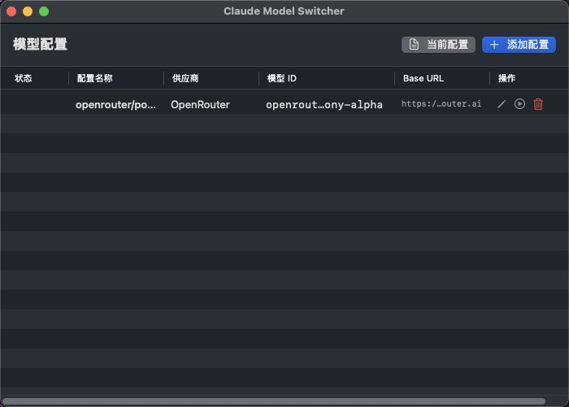

# Claude Model Switcher

**English** | [中文](README.zh-CN.md)



A native macOS application for quickly switching the Claude Code model, eliminating the need to manually edit configuration files.

## Features

- **Menu Bar Quick Switch**: Click the menu bar icon to quickly switch between favorite models
- **Main Window Management**: Full model list management with support for adding/editing/deleting custom models
- **Favorites**: Add frequently used models to favorites, displayed in the menu bar quick menu
- **Double-Click Switch**: Double-click a model in the left list to quickly switch models

## How to Run

### Option 1: Run the App Directly
```bash
cd /Users/yangsonhung/Projects/personal/ClaudeModelSwitcher
open "Claude Model Switcher.app"
```

### Option 2: Use Build Script
```bash
cd /Users/yangsonhung/Projects/personal/ClaudeModelSwitcher
./build.sh run      # Run
./build.sh build    # Build
./build.sh all      # Build and run
./build.sh clean    # Clean build files
```

### Option 3: Via Xcode
```bash
cd /Users/yangsonhung/Projects/personal/ClaudeModelSwitcher
open ClaudeModelSwitcher.xcodeproj
# Press Cmd+R to run
```

### Option 4: Using xcodebuild
```bash
cd /Users/yangsonhung/Projects/personal/ClaudeModelSwitcher
xcodebuild -project ClaudeModelSwitcher.xcodeproj -scheme ClaudeModelSwitcher -configuration Release build && open ~/Library/Developer/Xcode/DerivedData/ClaudeModelSwitcher-*/Build/Products/Release/Claude\ Model\ Switcher.app
```

## Usage

1. **Menu Bar**: Click the brain icon in the top-right menu bar and select a model to switch
2. **Main Window**: Click the Dock icon or select "Manage Models..." from the menu bar to open the main window
3. **Favorite Models**: Select a model in the main window and click "Add to Favorites"
4. **Add Custom Model**: Click the + button in the top-left to add a custom model

## System Requirements

- macOS 14.0+ (Sonoma)

## Configuration File

The app modifies the following fields in `~/.claude/settings.json`:
- `ANTHROPIC_MODEL`
- `ANTHROPIC_DEFAULT_SONNET_MODEL`
- `ANTHROPIC_DEFAULT_HAIKU_MODEL`
- `ANTHROPIC_DEFAULT_OPUS_MODEL`
- `ANTHROPIC_REASONING_MODEL`

## Development

### Project Structure
```
ClaudeModelSwitcher/
├── Sources/
│   ├── ClaudeModelSwitcherApp.swift   # App entry point
│   ├── Models/
│   │   ├── ClaudeSettings.swift       # Configuration data model
│   │   └── ModelProfile.swift         # Model profile template
│   ├── ViewModels/
│   │   └── SettingsViewModel.swift    # Business logic
│   ├── Views/
│   │   ├── MainWindow.swift           # Main window
│   │   ├── MenuBarView.swift          # Menu bar view
│   │   ├── ModelEditView.swift        # Model editing
│   │   └── SettingsView.swift         # Settings page
│   └── Services/
│       └── SettingsService.swift      # File I/O service
├── Claude Model Switcher.app          # Built application
├── ClaudeModelSwitcher.xcodeproj      # Xcode project
├── project.yml                        # XcodeGen configuration
└── build.sh                           # Build script
```

### Dependencies

- [XcodeGen](https://github.com/yonaskolb/XcodeGen): Used to generate Xcode projects
  ```bash
  brew install xcodegen
  ```

## License

MIT
